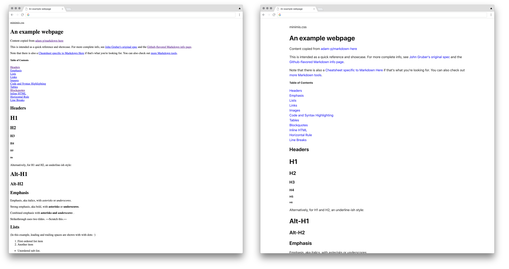

# minimis.css

minimis is a minimal drop-in css boilerplate for markup-centered content. It's meant to be dropped in to unstyled HTML pages, usually output from markdown renderers to provide sensible and un-ugly™️ styling.



### Usage

Add the following to your page's `<head>` tag:

```html
<link rel="stylesheet" href="https://cdn.jsdelivr.net/gh/kamaln7/minimis.css/dist/minimis.css" />
```

### Building minimis

To compile minimis, install the dependencies and run `npm run build`. The output will be stored in `dist/minimis.css`.

```
npm install
npm run build
```

### But why

🤷‍♂️

### License

MIT. See [LICENSE](/LICENSE)